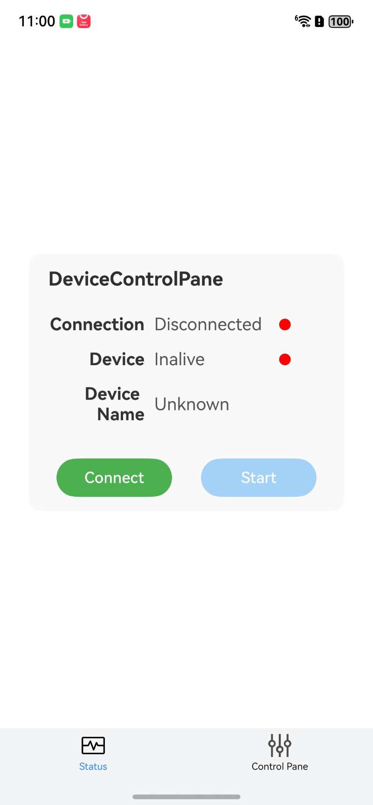
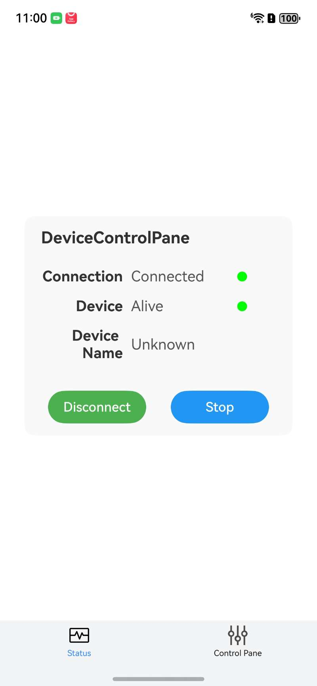
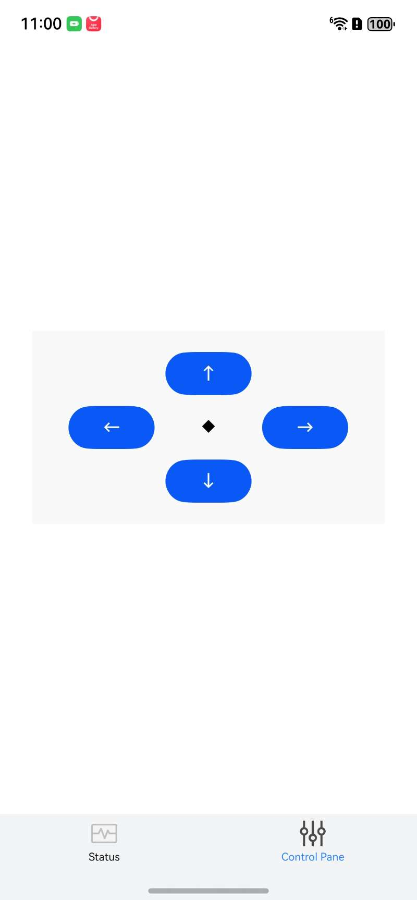

# HarmonyDeviceControl

## Usage 

在开始编译和安装之前，请先在 [Credit.ets](.\entry\src\main\ets\service\Credit.ets) 修改服务器信息和连接设备信息，如下：
```
static readonly  device_id: string  = '6825c9c984adf27cda58fdfc_myNodeId'
static readonly  host: string       = '192.168.24.167'
static readonly  port: string       = '8080'
static readonly  serviceId: string  = 'smokeDetector'
```

编译并安装到搭载 HarmonyOS NEXT 的鸿蒙手机后，打开 app：


点击连接（Connect）和启动（Start）按钮后，进入 `Control` 标签页：


通过点击方向键即可远程控制小车移动：
